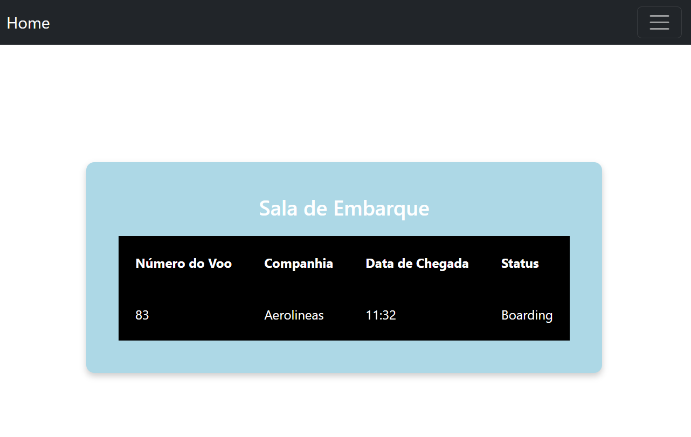

# Projeto Airport da disciplina de Desenvolvimento WEB
### Curso de Análise e Desenvolvimento de Sistemas IFSP -  ARARAQUARA

## Sobre o projeto:
O sistema desenvolvido possui como objetivo realizar o gerenciamento de um sistema áereo, com a possiilidade de realizar cadastros de voos, informando a Companhia Áerea, horário de chegada e qual o número do voo realizado. O sistema também permite a visualização dos voos de acordo com o seu status de voo, no caso sendo, Embarque, Desembarque, Decolando e os voos que já foram realizados, na página Decolados.

### Página inicial - Grettings
Essa página está explicando sobre o sistema, apenas para o usuário ter uma breve introdução do projeto.

### Login - ADM
Página que o Administrador realiza o seu login.

### Administração
Página que apenas o ADM possui autorização de entrar e realizar alterações.

### Desembarque 
Página que mostra os voos com o status de Desembarque.

### Embarque 
Página que mostra os voos com o status de Embarque.

### Decolando 
Página que mostra os voos com o status de Decolando.

### Decolados 
Página que mostra os voos com o status de Decolados.

## Desenvolvedora
Érika Santana Alves
